# Introduction to Python Plotting
README and slides created by Chance Loveday

Python is one of the top coding languages for analyzing and plotting scientific data, both in the HPC world and in general. This notebook contains a set of examples to get you started with common Python packages used for basic plotting. Specifically, we'll cover an introduction to Matplotlib, the fundamental plotting library for Python, as well as how it pairs with the NumPy and Pandas packages.

Packages in this notebook:

* [Matplotlib](https://matplotlib.org/stable/users/index.html): The most common general-purpose plotting library. Specifically we will be using the "pyplot" subpackage of Matplotlib for its useful plotting functions. "Matplotlib" and "pyplot" will be used interchangeably in this notebook
* [NumPy](https://numpy.org/doc/stable/): Used for processing data. Uses general n-dimensional "arrays" but does not have native plotting functions like Pandas. For that reason, it is usually paired with matplotlib
* [Pandas](https://pandas.pydata.org/docs/user_guide/index.html#user-guide): Used for processing and plotting data. Uses "dataframes" that are specialized to handle **tabulated** data. Also has native plotting capabilities
* [[Optional] Seaborn](https://seaborn.pydata.org/): Typically used for generating statistical graphs and uses matplotlib behind the scenes

### What is Matplotlib?
- Matplotlib is a comprehensive library for creating static, and interactive visualizations in Python
- It provides a MATLAB-like interface for plotting
- Essential for data visualization, data analysis, and scientific computing
- Works seamlessly with NumPy and Pandas

### **Table of Contents**
* [**Matplotlib Basics**](#packages)
    * [Getting Started with Numpy](#getting-started)
    * [1. Figure and Axes](#figs-and-axes)
    * [2. Customizing Plots: Colors, Styles, Markers, and Labels](#customize)
    * [3. Scatter Plots](#scatter)
    * [4. Bar Charts](#bars)
    * [5. Histograms and Pie Charts](#hists-and-pies)
    * [6. Pandas Dataframes](#pandas)
    * [7. Subplots](#subplots)
    * [8. Advanced Plots](#advanced-plots)
    * [9. Advanced Customization](#advanced-custom)
    * [10. Saving Figures](#save)
* [Cheat Sheet](#cheat-sheet)
* [Extra Content](#optional)

### <a name="packages"></a> Import Packages
```python
import matplotlib.pyplot as plt
import numpy as np
```

> **Note:** How you use `import package_name as package_shorthand` comes down to personal preference. For your future work, feel free to use whichever `package_shorthand` you prefer.


### <a name="getting-started"></a> Getting Started with NumPy
NumPy is most known for its implementation of arrays, but you can also use built-in mathematical operations (e.g., trig functions).

```python
# Generate some data using NumPy arrays
x1 = np.array((1,2,3,4,5)) # x-axis values
y1 = np.array((6,7,8,9,10)) # y-axis values
#print(x1,y1)

# Generate a dataset by mapping x-values to a sine curve
x2 = np.linspace(0, 10, 100)  # 100 equally-spaced points from 0 to 10
y2 = np.sin(x2)
#print(x2,y2)
```

You can also generate your own random data using numpy.

This will come into play later.

```python
x3 = np.linspace(0,1000,1000) # start, stop, num
y3 = np.random.rand(1000) # num, from interval [0,1) by default
#print(x3,y3)
```

## <a name="figs-and-axes"></a> Section 1: Figures and Axes
**Key Concepts:**
- **Figure**: The top-level container (the entire window/page)
- **Axes**: The actual plot area (where data is drawn)
- **Axis**: A single number line (x-axis, y-axis)
- Think of the figure as a canvas, and axes as individual paintings on that canvas

**Commands:**
- Plot - Creates a relationship/function between two sets of data
- Title - Title label
- Legend - Legend for any plot labels; **Must be enabled to show labels**
- Show - Necessary to display outside of notebooks

```python
x = [1, 2, 3, 4, 5]
y = [2, 4, 6, 8, 10]

# Method 1: Pyplot approach (quick and simple)
plt.plot(x, y)
plt.plot(y, x)
plt.xlabel('X Axis')
plt.ylabel('Y Axis')
plt.title('Simple Line Plot')
plt.show()


# Method 2: Object-oriented approach (more control, recommended for complex plots)
fig, ax = plt.subplots()  # Creates a figure and axes object. Notice that this uses the axes API rather than the default
ax.plot(x, y)
ax.set_xlabel('X Axis')
ax.set_ylabel('Y Axis')
ax.set_title('Line Plot (Object-Oriented)')
plt.show()
```

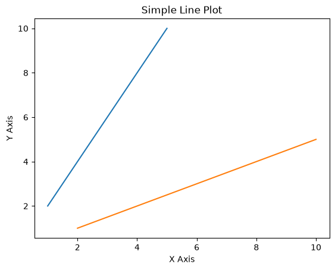

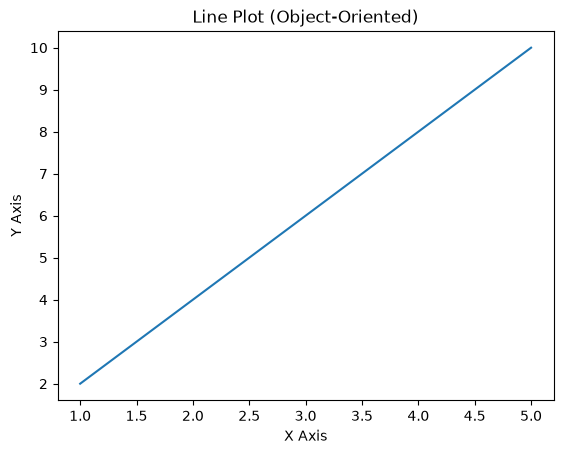

## <a name="customize"></a> Section 2: Customizing Plots: Colors, Styles, Markers, and Labels
Various aesthetic options are available; I listed some popular ones below.

**Styling Options**
- Markers
    - d = diamond
    - o = circle
    - ^ = triangle
- Line Styling (ls)
    - '--' = dashed
    - '-' = solid
    - ':' = dotted
    - '' = empty
- Colors
    - k = black
    - r = red
    - g = green
    - b = blue (default)
    - c = cyan
    - m = magenta
    - y = yellow
- Labels (Add any text)


```python
# Create some sample data
x = np.linspace(0, 10, 100)  # 100 points from 0 to 10
y = np.cos(x)

# Simple line plot
plt.figure(figsize=(8, 5))  # figsize=(width, height) in inches
plt.plot(x, y, label="cos(x)")
plt.xlabel('X values')
plt.ylabel('cos(X)')
plt.title('Cosine Wave')
plt.legend()
plt.grid(True)  # Add grid for easier reading
plt.show()
```

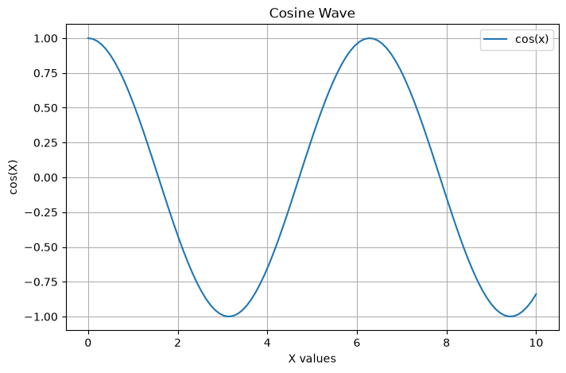

Say you had a large set of data and need to set limits on your axes.

Limits allow you to do just that.

```python
# Multiple lines on the same plot

# Three different trig graphs
x = np.linspace(0, 10, 100)
y1 = np.sin(x)
y2 = np.cos(x)
y3 = np.sin(x) * np.cos(x)

# Using subplot to show detailed control over axes
fig, ax = plt.subplots()
ax.plot(x, y1, label='sin(x)', color="orange")
ax.plot(x, y2, label='cos(x)', color='g')
ax.plot(x, y3, label='sin(x) * cos(x)', color='#7851A9', ls='--')

# Axis Labels and Limits
ax.set_xlabel('X values')
ax.set_ylabel('Y values')
#ax.set_xscale('log')    # Change this value to see what happens
ax.set_xlim(1,10)        # Change this value and see what happens

ax.set_title('Multiple Trig Functions')
ax.legend()  # Show legend
ax.grid(True, alpha=0.3)  # alpha controls transparency
plt.show()
```

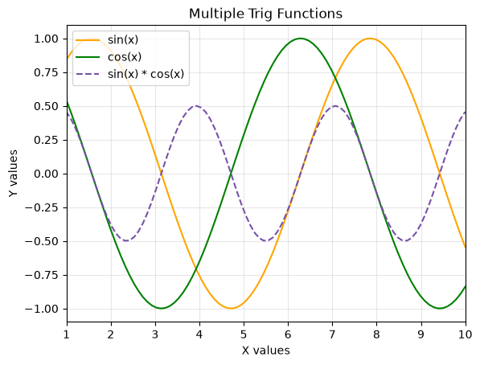

### More Customization
Matplotlib offers extensive customization options to make your plots visually appealing and informative.

When you assign a color, you can do so in several different ways:
- Color abbreviation (e.g., color='k' for black)
- Explicit color name (e.g., color='black')
- Hex Code (e.g., color='#000000')

```python
x = np.linspace(0, 10, 20)

# Different line styles and markers
# Using a mix of color abbreviations, explicit color names, and hex codes
plt.figure(figsize=(12, 6))

plt.plot(x, x, color='steelblue', label='Solid line', linewidth=2)
plt.plot(x, x+1, color='#FF6B6B', label='Dashed line', linewidth=2)
plt.plot(x, x+2, color='darkgreen', label='Dash-dot line', linewidth=2)
plt.plot(x, x+3, color='magenta', label='Dotted line', linewidth=2)
plt.plot(x, x+4, 'co-', label='Circles', markersize=8)
plt.plot(x, x+5, 's-', label='Squares', markersize=6)
plt.plot(x, x+6, '^-', label='Triangles', markersize=6)

plt.xlabel('X Axis')
plt.ylabel('Y Axis')
plt.title('Line Styles and Markers')
plt.legend()
plt.grid(True, alpha=0.3)
plt.show()
```

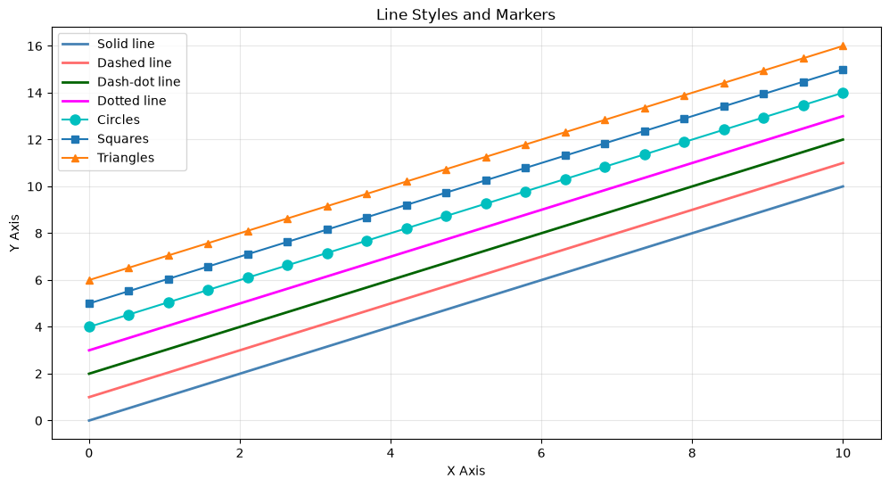

## <a name="scatter"></a> Section 3: Scatter Plots
Scatter plots are excellent for visualizing relationships between two variables and identifying correlations. Matplotlib lets you take one step further with scatter plots.

```python
# Generate sample data with a linear relationship
np.random.seed(42)
x = np.random.randn(100)
y = x + np.random.randn(100) * 0.5  # Linear relationship with noise

# TODO: Change y to a nonlinear function and reduce noise to 0.25.


# Basic scatter plot
plt.figure(figsize=(8, 6))
plt.scatter(x, y, alpha=0.6)  # alpha controls transparency
plt.xlabel('X values')
plt.ylabel('Y values')
plt.title('Linear Scatter Plot')
plt.grid(True, alpha=0.3)
plt.show()
```

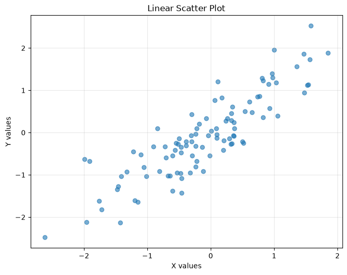

Let's look at examples where we can adjust the color and size of the data points. In this first example, we'll randomize the color and size for each point. You can set a color mapping using the 'cmap' parameter.

```python
# Random Overlapping Scatter plot with different colors and sizes
np.random.seed(42)
x = np.random.randn(100)
y = np.random.randn(100)
colors = np.random.rand(100)  # Random colors
sizes = 500 * np.random.rand(100)  # Random sizes


plt.figure(figsize=(10, 6))
plt.scatter(x, y, c=colors, s=sizes, alpha=0.6, cmap='plasma')
plt.colorbar(label='Color intensity')  # Add colorbar
plt.xlabel('X values')
plt.ylabel('Y values')
plt.title('Scatter Plot with Color and Size Variations')
plt.grid(True, alpha=0.3)
plt.show()

# Popular colormaps: 'viridis', 'plasma', 'coolwarm', 'RdYlBu', 'Set1'
```

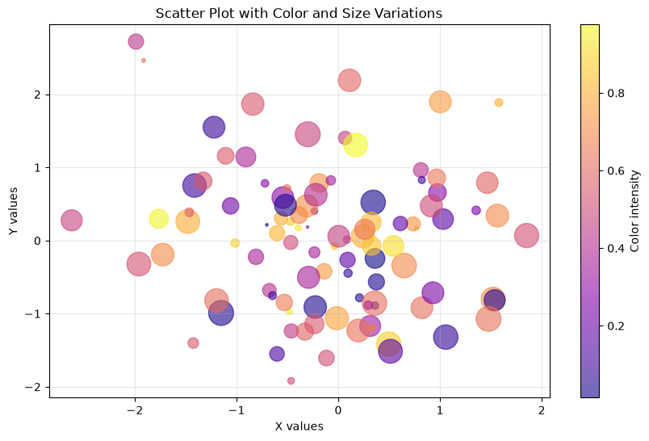

In this second example, we want size to be meaningful, so let's make it dependent on the x-position. This gives us a clearer idea of perhaps more subtle patterns in the data.

```python
# Scatter plot where size depends on x-value
np.random.seed(42)
x = np.random.randn(100)
y = np.random.randn(100)
colors = np.random.rand(100)  # Random colors

min_size = 10
max_size = 100
# Normalize X between 0 and 1, then scale to our desired range
x_normalized = (abs(x)) / (x.max() - x.min())
sizes = min_size + x_normalized * (max_size - min_size)


plt.figure(figsize=(10, 6))
plt.scatter(x, y, c=colors, s=sizes, alpha=0.6, cmap='plasma')
plt.colorbar(label='Color intensity')  # Add colorbar
plt.xlabel('X values')
plt.ylabel('Y values')
plt.title('Scatter Plot with Color and Size Variations')
plt.grid(True, alpha=0.3)
plt.show()
```

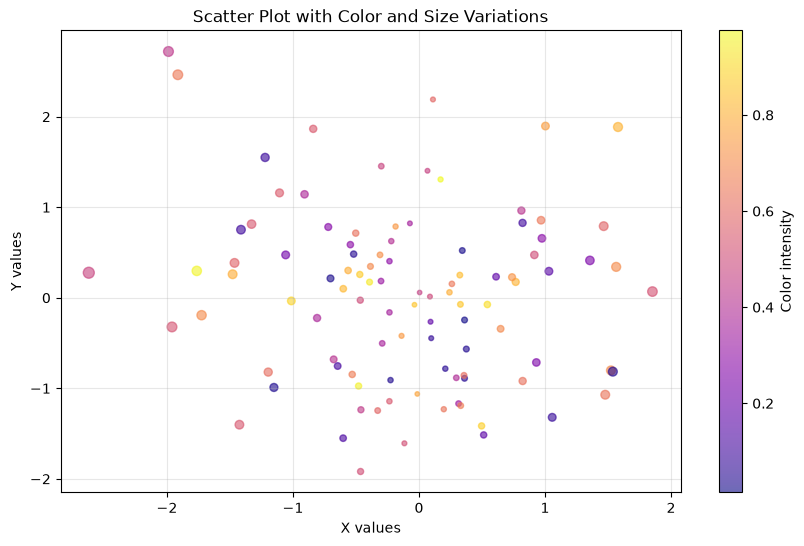

## <a name="bars"></a> Section 4: Bar Charts
Bar charts are ideal for comparing groups, or categorical data. They allow you to compare counts between multiple groups.

We can generate values for an example dataset using the built-in random package. Let's make an example dataset that randomly generates the counts of different quantum gates.

The implementation for vertical and horizontal bar charts are slightly different.

Vertical (Default): `plt.bar(categories, values, ...)`

vs.

Horizontal: `plt.barh(categories, values, ...)`

```python
# Simple bar chart
import random
categories = ['H', 'X', 'Y', 'Z', 'CNOT']
values = [random.randint(1,12) for i in range(5)]
print(values)

plt.figure(figsize=(8, 6))
plt.bar(categories, values, color='purple', edgecolor='black', linewidth=1.2)
plt.xlabel('Q-Gates')
plt.ylabel('Counts')
plt.title('Simple Q-Gate Bar Chart')
plt.grid(True, alpha=0.3, axis='y')  # Only horizontal grid lines
plt.show()
```

```
[1, 11, 7, 8, 9]
```

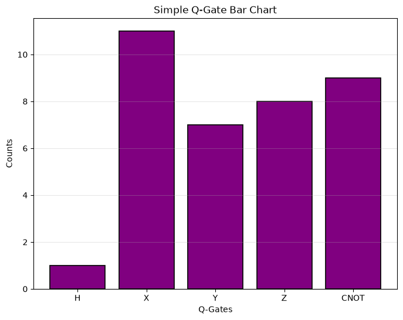

```python
# Horizontal bar chart
plt.figure(figsize=(8, 6))
plt.barh(categories, values, color='coral', edgecolor='black', linewidth=1.2)
plt.xlabel('Values')
plt.ylabel('Categories')
plt.title('Horizontal Q-Gate Bar Chart')
plt.grid(True, alpha=0.3, axis='x')
plt.show()
```

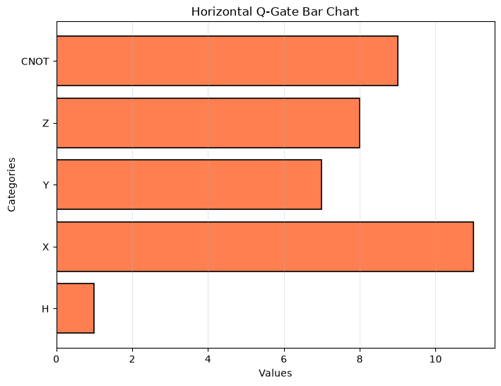

Bar charts are also useful for visualizing groups of categorical data over different periods or regions.

```python
# Grouped bar chart
categories = ['Wii Sports', 'Mario Kart Wii', 'GTA 5', 'Pokemon Red/Blue']
NA_sales = [41.49, 15.85, 20.44, 11.27]
EU_sales = [29.02, 12.88, 20.39, 8.89]
JP_sales = [3.77, 3.79, 1.39, 10.22]

x = np.arange(len(categories))
width = 0.25  # Width of bars

plt.figure(figsize=(10, 6))
plt.bar(x - width, NA_sales, width, label='NA Sales', color='#FF6B6B')    # x: center position for second group (no shift)
plt.bar(x, EU_sales, width, label='EU Sales', color='#4ECDC4')            # x + width: x-position (shift right by one bar width to position third group)
plt.bar(x + width, JP_sales, width, label='JP Sales', color='#95E1D3')

plt.xlabel('Region')
plt.ylabel('Sales (in millions)')
plt.title('Video Game Sales by Region')
plt.xticks(x, categories)
plt.legend()
plt.grid(True, alpha=0.3, axis='y')
plt.show()
```

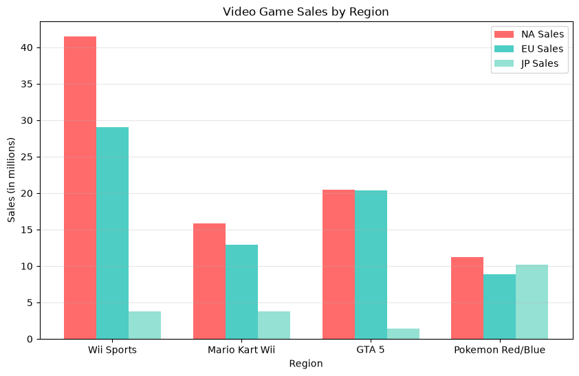

## <a name="hists-and-pies"></a> Section 5: Histograms & Pie Charts
### Histograms
Histograms can be used to distribute numerical data over a set of bins.

* Here we define a random normal data distribution of size `N_points`.
* In the first example, we see `data = np.random.normal(70, 10, 1000)`. This means the histogram is centered around 70, has a standard deviation of 10, and 1000 data .

```python
# Generate sample data
np.random.seed(42)
data = np.random.normal(70, 10, 1000)  # Mean = 70, Std Dev = 10, 1000 points

# Basic histogram
plt.figure(figsize=(10, 6))
plt.hist(data, bins=30, color='skyblue', edgecolor='black', alpha=0.7)
plt.xlabel('Value')
plt.ylabel('Frequency')
plt.title('Histogram of Normal Distribution')
plt.grid(True, alpha=0.3, axis='y')
plt.show()
```

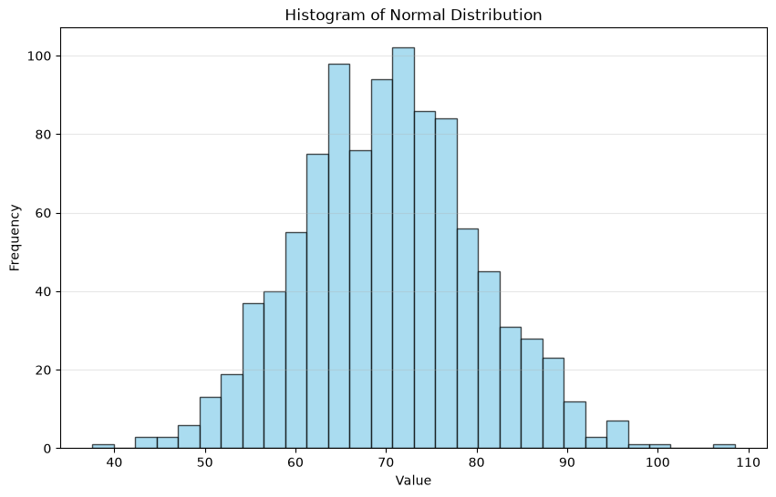

Overlapping histograms are simply distributions that act independently of one another and overlap based on their means and deviations.

```python
# Multiple histograms on the same plot
np.random.seed(42)
data1 = np.random.normal(58, 9, 1000)
data2 = np.random.normal(80, 6, 1000)

plt.figure(figsize=(10, 6))
plt.hist(data1, bins=30, alpha=0.6, label='Dataset 1', color='blue')
plt.hist(data2, bins=30, alpha=0.6, label='Dataset 2', color='red')
plt.xlabel('Value')
plt.ylabel('Frequency')
plt.title('Overlapping Histograms')
plt.legend()
plt.grid(True, alpha=0.3, axis='y')
plt.show()
```

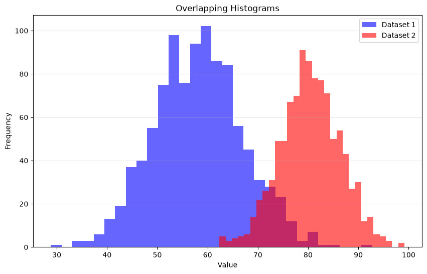

### Pie Charts
Pie charts are useful for showing proportions and percentages.

```python
# Simple pie chart
categories = ['All 20', '8-19', '7', 'Less than 3']
sizes = [2, 31, 41, 22]
colors = ["#6BDFFFFF", '#4ECDC4', '#95E1D3', '#F38181']
explode = (0, 0, 0.1, 0)  # Explode the slice for 'exactly 7'

fig, ax = plt.subplots(figsize=(8, 8))
ax.pie(sizes, explode=explode, labels=categories, colors=colors,
       autopct='%1.1f%%', shadow=True, startangle=90)
ax.set_title('Percentage of HPC 2025 Challenges Completed', fontsize=14, fontweight='bold')
plt.show()
```

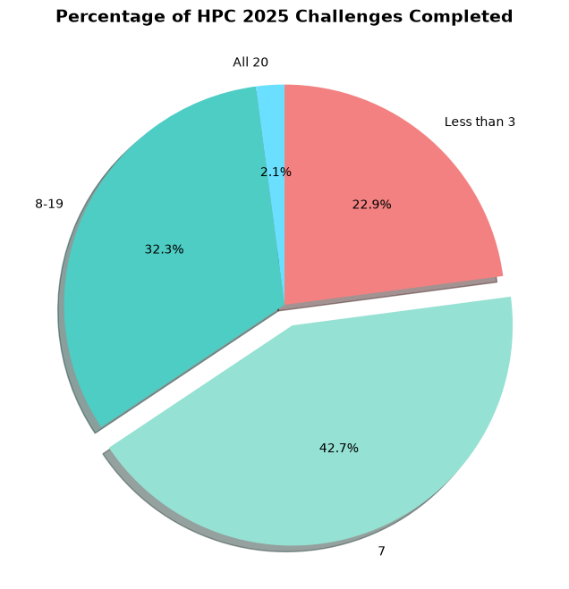

**Note:** The above pie chart is based on real data from the 2025 HPC Crash Course

## <a name="pandas"></a> Section 6: Pandas Dataframes
```python
import pandas as pd
```

Pandas offers DataFrames to efficiently store data and glean data from spreadsheets. A Pandas DataFrame can be plotted directly via the `plot()` method. You provide the rows (as arrays) and then the column labels.

By default, Pandas will plot data against the index value of each row (for every named column). If you're using the Axes API, you can pass `ax` arguments via `df.plot(ax=name_of_axes)`. In our case, the name of our axis is `ax`, so we use `df.plot(ax=ax)`.

Below we compare how plots appear when using Pandas vs. the native plotting feature of Matplotlib. Notice that Pandas automatically includes a legend, while Matplotlib provides the option to exclude a legend or customize it.

```python
# Create a Pandas DataFrame
df = pd.DataFrame( np.array( ([1,2,3] , [4,5,6] , [7,8,9]) ), columns=['a','b','c'] )
print("NumPy DataFrame:")
print(df)

fig, ax = plt.subplots(nrows=1,ncols=2)

# Plot via Pandas
df.plot(marker='o',ax=ax[0])

# Plot via Matplotlib
ax[1].plot(df,marker='o')

ax[0].set_title('Plot 2.1.1: Pandas')
ax[1].set_title('Plot 2.1.1: Matplotlib')

plt.show()
```

```
NumPy DataFrame:
   a  b  c
0  1  2  3
1  4  5  6
2  7  8  9
```

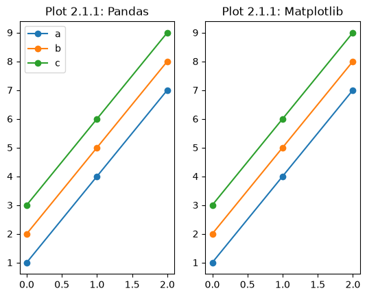

Here's another sample dataframe. Use it to generate a plot.

```python
# Create a sample DataFrame
np.random.seed(42)
dates = pd.date_range('2023-01-01', periods=100, freq='D')
df = pd.DataFrame({
    'Date': dates,
    'Sales': np.random.randint(1000, 5000, 100) + np.sin(np.arange(100)) * 500,
    'Profit': np.random.randint(200, 800, 100) + np.cos(np.arange(100)) * 200,
    'Region': np.random.choice(['North', 'South', 'East', 'West'], 100)
})

print("Sample DataFrame:")
print(df.head())
print(f"\nDataFrame shape: {df.shape}")
```

```
Sample DataFrame:
        Date        Sales      Profit Region
0 2023-01-01  4174.000000  801.000000  South
1 2023-01-02  4927.735492  863.060461   East
2 2023-01-03  2314.648713  277.770633  South
3 2023-01-04  2364.560004  203.001501   East
4 2023-01-05  1751.598752  338.271276  North

DataFrame shape: (100, 4)
```

```python
# Plot directly from DataFrame
plt.figure(figsize=(12, 6))
plt.plot(df['Date'], df['Sales'], label='Sales', linewidth=2)
plt.plot(df['Date'], df['Profit'], label='Profit', linewidth=2)
plt.xlabel('Date')
plt.ylabel('Amount ($)')
plt.title('Sales and Profit Over Time (df-plotted)')
plt.legend()
plt.grid(True, alpha=0.3)
plt.xticks(rotation=45)  # Rotate x-axis labels
plt.tight_layout()
plt.show()
```

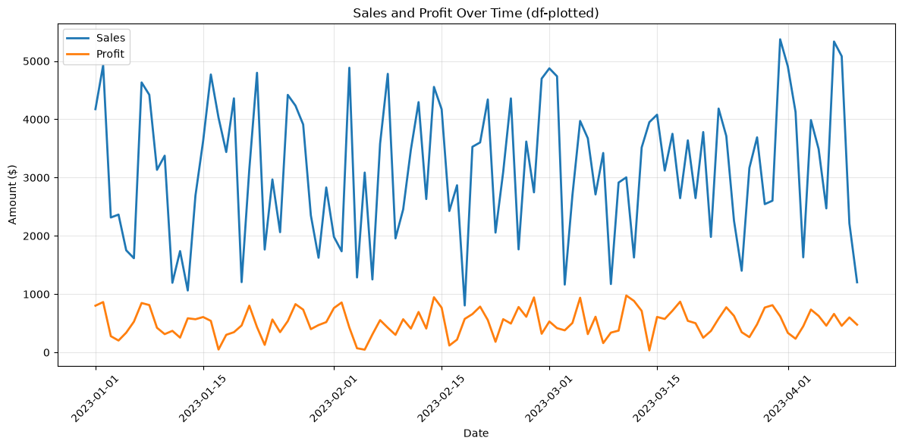

Alternatively, Pandas offers an option to plot directly.

`region_sales = df.groupby('Region')['Sales'].mean()` --> This line is using Pandas to sort the data into groups based on their means. This allows us to implement the bar chart seen below.

```python
# Using pandas plot method (even simpler!)
fig, axes = plt.subplots(2, 1, figsize=(12, 10))

# Plot using pandas .plot() method
df.plot(x='Date', y='Sales', ax=axes[0], color='steelblue', linewidth=2)
axes[0].set_title('Sales Over Time (Pandas Plot)', fontsize=12)
axes[0].set_ylabel('Sales ($)')
axes[0].grid(True, alpha=0.3)
axes[0].tick_params(axis='x', rotation=45)

# Bar chart by region
region_sales = df.groupby('Region')['Sales'].mean()
region_sales.plot(kind='bar', ax=axes[1], color='coral', edgecolor='black')
axes[1].set_title('Average Sales by Region', fontsize=12)
axes[1].set_ylabel('Average Sales ($)')
axes[1].set_xlabel('Region')
axes[1].grid(True, alpha=0.3, axis='y')

plt.tight_layout()
plt.show()
```

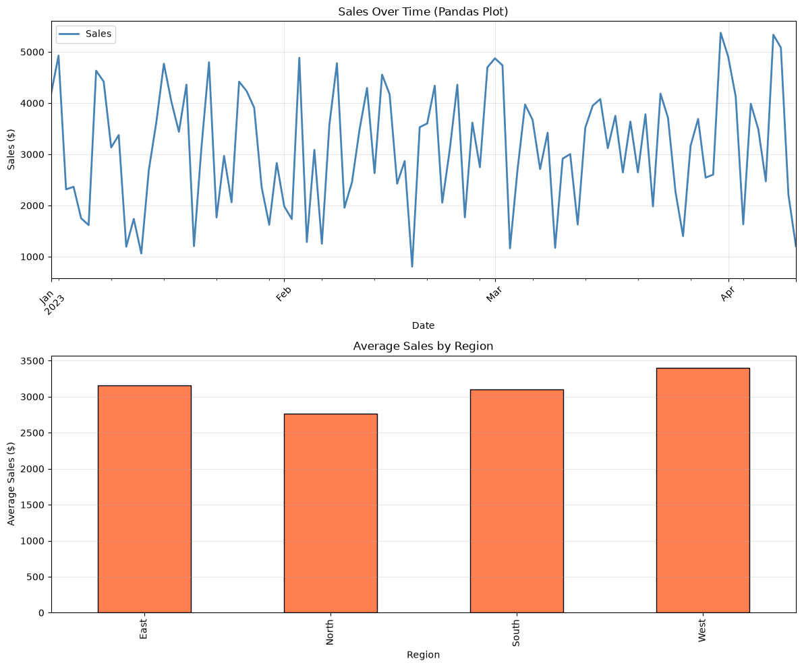

### Reading from .csv file
Instead of generating our own DataFrame using NumPy+Pandas, let's read in a premade CSV dataset.

In this case, our DataFrame is no longer named `df` and is named `iris`, so to plot it we will use `iris.plot()`.

Instead of using the default plot configurations, let's make it a scatter plot this time using the `kind='scatter'` argument. More specifically, let's make a scatter plot of the `sepal_length` and `sepal_width` columns.

> Note: A Matplotlib equivalent plot line is given in the comments.

```python
# Reading data into a DataFrame (e.g., CSV file)
iris = pd.read_csv('https://raw.githubusercontent.com/mwaskom/seaborn-data/master/iris.csv')
#print(iris)
# TODO: Uncomment the print statement above to show the tabulated data.

fig, ax = plt.subplots(nrows=1,ncols=1)
iris.plot(kind='scatter', x="sepal_length", y="sepal_width", ax=ax)

# Matplotlib equivalent
#ax.plot(iris['sepal_length'], iris['sepal_width'], 'o')

plt.title('Plotting CSV Data')
#plt.show()
```

```
     sepal_length  sepal_width  petal_length  petal_width    species
0             5.1          3.5           1.4          0.2     setosa
1             4.9          3.0           1.4          0.2     setosa
2             4.7          3.2           1.3          0.2     setosa
3             4.6          3.1           1.5          0.2     setosa
4             5.0          3.6           1.4          0.2     setosa
..            ...          ...           ...          ...        ...
145           6.7          3.0           5.2          2.3  virginica
146           6.3          2.5           5.0          1.9  virginica
147           6.5          3.0           5.2          2.0  virginica
148           6.2          3.4           5.4          2.3  virginica
149           5.9          3.0           5.1          1.8  virginica

[150 rows x 5 columns]
```

```
Text(0.5, 1.0, 'Plotting CSV Data')
```

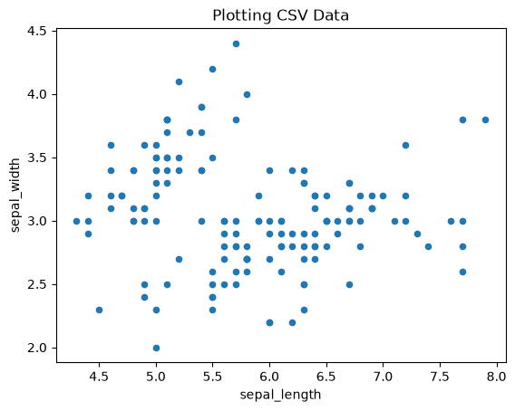

## <a name="subplots"></a> Section 7: Subplots
Subplots allow you to create multiple plots in a single figure. This is great for comparing different visualizations, especially different representations of the same data.

In this first example, we want to display three trig graphs in a single column: sine, cosine, and tangent.
- Make sure you use the **Axes API** when declaring your subplots: `fig, ax = plt.subplots(3, 1)`
- Think of each subplot being an item in a list. In lists, we index each item; we do the same with subplots!

```python
# Subplots of sin, cos, and tan
# Create some sample data
x = np.linspace(0, 10, 100)  # 100 points from 0 to 10

# Trig Subplots
# Sin Plot
fig, ax = plt.subplots(3, 1, figsize=(10, 10))
ax[0].plot(x, np.sin(x), color='indigo')
ax[0].set_xlabel('X values')
ax[0].set_ylabel('sin(x)')
ax[0].set_title('Sine Wave')
ax[0].grid(True)

# Cos Plot
ax[1].plot(x, np.cos(x), color='darkGreen')
ax[1].set_xlabel('X values')
ax[1].set_ylabel('cos(x)')
ax[1].set_title('Cosine Wave')
ax[1].grid(True)

# Tan Plot
ax[2].plot(x, np.tan(x), color='darkOrange')
ax[2].set_xlabel('X values')
ax[2].set_ylabel('tan(X)')
ax[2].set_title('Tangent Wave')
ax[2].grid(True)

plt.tight_layout()
plt.show()
```

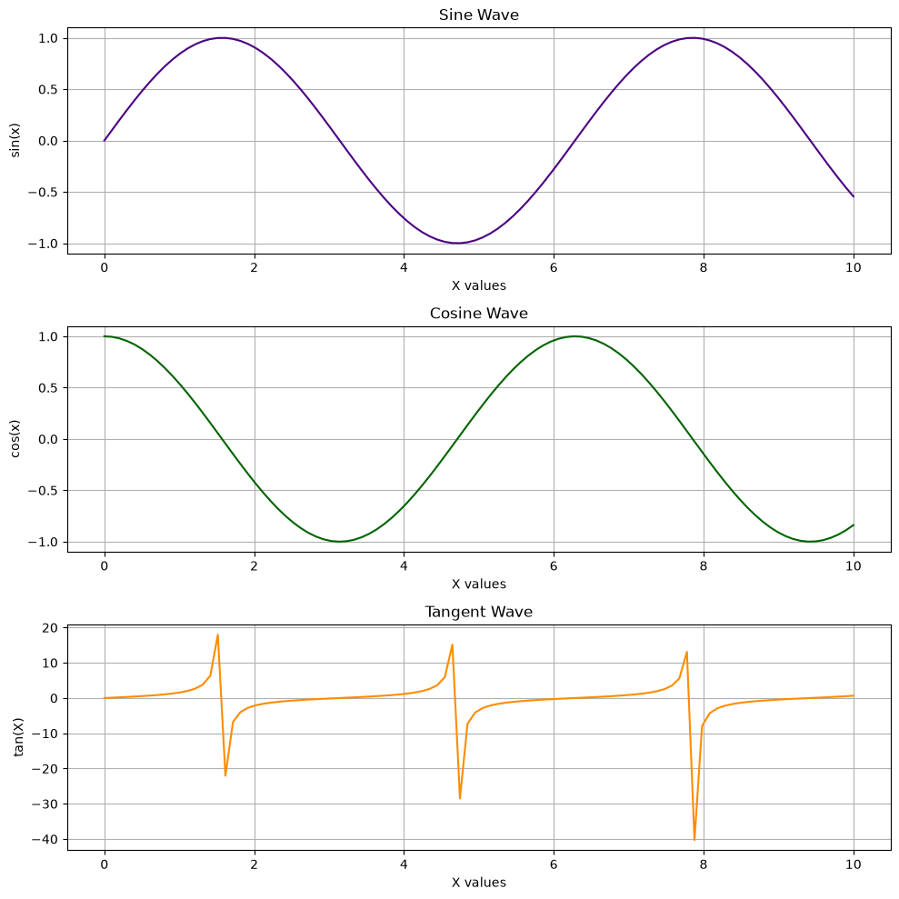

We can display multiple plots at once, and they don't need to be the same type. In this second example, display y=x^2, a scatterplot, a bar chart, and a pie chart.

```python
# Create 2x2 subplot grid
x = np.linspace(0, 10, 100)

fig, axes = plt.subplots(2, 2, figsize=(12, 10))
fig.suptitle('Multiple Subplots', fontsize=16, fontweight='bold')

# Top left: Line plot
axes[0, 0].plot(x, x**2, 'b-', linewidth=2)
axes[0, 0].set_title('y=x^2')
axes[0, 0].grid(True, alpha=0.3)

# Top right: Scatter
np.random.seed(42)
x_scatter = np.random.randn(100)
y_scatter = np.random.randn(100)
axes[0, 1].scatter(x_scatter, y_scatter, alpha=0.6, c=x_scatter, cmap='viridis')
axes[0, 1].title('Scatter Plot')
axes[0, 1].grid(True, alpha=0.3)

# Bottom left: Bar Chart
categories = ['A', 'B', 'C', 'D']
values = [23, 45, 56, 78]
axes[1, 0].bar(categories, values, color='coral')
axes[1, 0].set_title('Bar Chart')
axes[1, 0].grid(True, alpha=0.3, axis='y')

# Bottom right: Pie Chart
categories = ['North', 'South', 'East', 'West']
sizes = [30, 25, 20, 25]
colors = ['#FF6B6B', '#4ECDC4', '#95E1D3', '#F38181']
explode = (0.1, 0, 0, 0)  # Explode the first slice

axes[1,1].pie(sizes, explode=explode, labels=categories, colors=colors,
       autopct='%1.1f%%', shadow=True, startangle=90)
axes[1,1].set_title('Pie Chart', fontsize=14, fontweight='bold')
axes[1, 1].grid(True, alpha=0.3, axis='y')

# Optional: Automating Name settings for all subplots
'''
plot_rows=2
plot_cols=2
for i in range(0,plot_rows):
    for j in range(0, plot_cols):
       axes[i,j].set_xlabel('X-data')
       axes[i,j].set_ylabel('Y-data')
       axes[i,j].legend()
       axes[i,j].set_title(f'Subplot {i+1}')
'''

plt.tight_layout()  # Adjust spacing between subplots
plt.show()
```

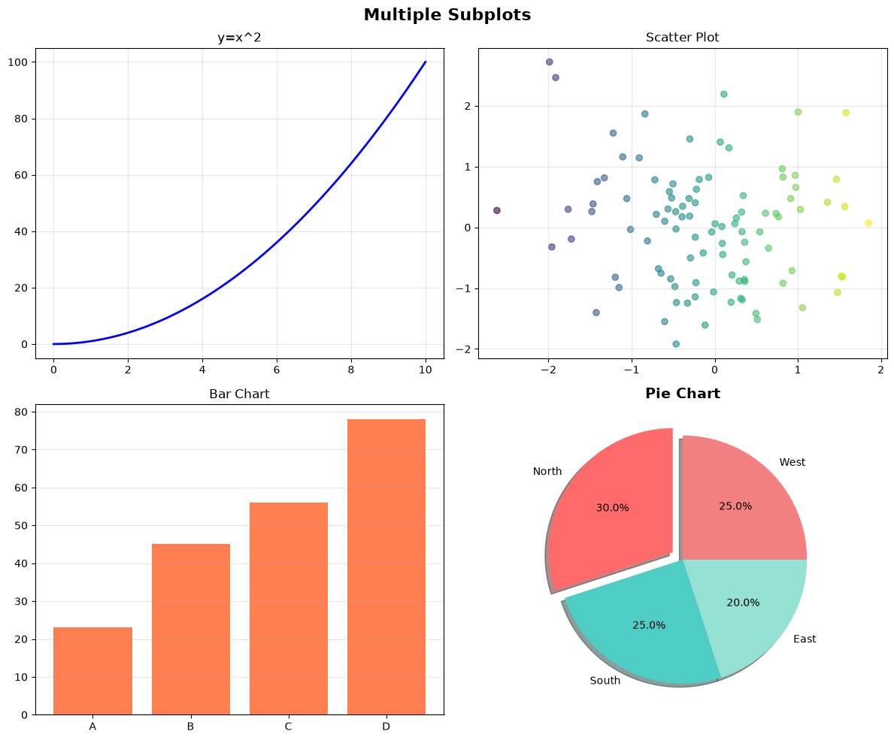

## <a name="advanced-plots"></a> Section 8: Advanced Plots
### 2D Histograms
2D Histograms use the `hist2d()` function. They can be used to plot two data distributions against each other instead of individually, utilizing colormaps and colorbars to help visualize data.

* The `plt.colorbar()` function is used to create a colorbar for a given figure. Since we assigned our 2D histogram to the `hist` variable, this is what we pass to the colorbar function to create a colorbar distribution for the data.
* Note that in the case of 2D histograms, `hist[3]` specifically must be passed, but in general you can just pass the entire variable. Additionally, the colorbar function can accept multiple configuration arguments, like `location`, `orientation`, and a `label`.
* We've included an additional method in the comments below to implement a colorbar by manually creating axes for it. Using this method gives you tighter control over the height, width, ticks, and placement of your colorbar relative to a given figure.

More details about colorbar settings can be found here: https://matplotlib.org/stable/api/_as_gen/matplotlib.pyplot.colorbar.html

```python
# Histogram parameters & distribution data
N_points = 100000
dist1 = np.random.normal(size=N_points)
dist2 = np.random.normal(loc=10.0,size=N_points)

# Initialize the figure
fig, ax = plt.subplots(nrows=1,ncols=1,figsize=(5,5))

# Make 2D histogram
hist = ax.hist2d(dist1, dist2, bins=(20,80), cmap='magma')

# Method 1: Standard Colorbar Method
# hist[3] is used **in this case** because of how histograms display data
cbar=plt.colorbar(hist[3],location='right', orientation='vertical', label='Counts')

# Method 2: Customizeable Colorbar Method
# TODO: Comment out the standard colorbar above, and try this colorbar instead.
'''
cbaxes = fig.add_axes([.91, .11, .1, 0.77]) # Format: left edge position, bottom edge position, width, height
cbar=plt.colorbar(hist[3], orientation='vertical',cax=cbaxes)
cbaxes.yaxis.set_ticks_position('right') # must come AFTER plt.colorbar call
cbar.set_label('Counts',rotation=90,size=10, loc='center') # x=, y= can also be called here to set location of label (y for vertical cbars, x for horizontal cbars)
'''

ax.set_title('Plot 1.3.1: 2D Histogram')

# "Show" the plot
plt.show()
```

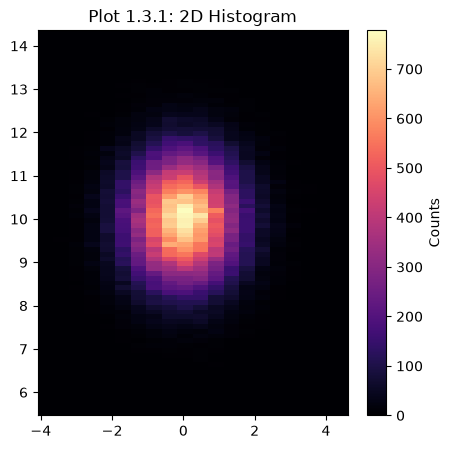

### 3D Plots
Plotting 3D data in Matplotlib isn't very common since other tools provide more specialized handling of 3D data. However, you can still visualize simple 3D datasets with Matplotlib.

* In this example, we will generate random points in the form of a cube, but plot a specific selection of them. We will only care about the ones within a radius of 1 relative to the center of the domain.

**The key to getting a 3D plot to work in Matplotlib is to use the `subplot_kw={'projection': '3d'}` keyword argument in `plt.subplots()`.**
1) Here, we generate 1000 random `x`, `y`, and `z` datapoints confined to a domain of [-1,1) using the `np.random.rand()` function.
2) Next, we calculate the radius (`r`) from each point to the center, and slice the data so that we only include points with `r<=1`.
3) Next, we use the `scatter()` function to make a scatter plot of all of our points within r=1. Alternatively, you can use the `plot()` function with certain markers and line styles.

For more examples of 3D plots in Matplotlib, see: https://matplotlib.org/stable/gallery/mplot3d/index.html

```python
# Fixing random state for reproducibility
np.random.seed(19680800)

# Create random data from [-1,1), Math: [0,1) --> [0,2) --> [-1,1)
x = ( 2. * np.random.rand(1000) ) - 1.
y = ( 2. * np.random.rand(1000) ) - 1.
z = ( 2. * np.random.rand(1000) ) - 1.

# Extract points within a r=1 sphere
r = np.sqrt(x**2 + y**2 + z**2)
x_sphere = x[ r<=1 ]
y_sphere = y[ r<=1 ]
z_sphere = z[ r<=1 ]

# Initialize the 3D figure
fig, ax = plt.subplots(subplot_kw={'projection': '3d'})

# Make a scatter plot with either the "scatter" method or just plotting with "plot" without a linestyle
ax.scatter(x_sphere,y_sphere,z_sphere, marker='o')
#ax.plot(x_sphere,y_sphere,z_sphere, marker='.', ls='', alpha=0.5)

# Annotations --> This is how we label the axes in this case; we'll dive into this soon.
ax.set_xlabel('X Label')
ax.set_ylabel('Y Label')
ax.set_zlabel('Z Label')
ax.set_title('3D Plot')

# "Show" the plot
plt.show()

# Just for fun, this is a good example of a very intro Monte Carlo problem
N_box = 1000. # total number of random points within [-1,1]
N_sphere = len(r[r<=1.]) # number of points within the sphere
vol_box = 2.**3.
vol_sphere = vol_box*(N_sphere/N_box)

print('Real volume of a sphere of r=1 is', (4./3.)*np.pi)
print('Approximate volume is', vol_sphere)
```

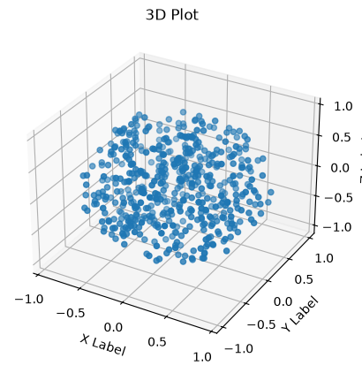

```
Real volume of a sphere of r=1 is 4.1887902047863905
Approximate volume is 4.136
```

## <a name="advanced-custom"></a> Section 9: Advanced Customization
Matplotlib offers much more styling options than we have discussed so far. You can add annotations to your plots and have finer control over legends (e.g., location, font, title, other styling).

Annotations are additional labels that can inserted on top of the plot. An annotation is created by `ax.annotate, and the options include the following:
* text: The literal string that appears with the annotation
* xy: Coordinates for the annotation
* arrowprops: Styling options for arrows connecting to the annotation
* fontsize
* fontweight
* color

Text boxes are another form of labels that are inserted on top of the plot and can placed with using absolute psoitioning.

Customizing the legend is also possible through Matplotlib. You can adjust where the legend will appear, border styling, shadowing, font size, and a legend title label.

```python
# Adding annotations and text
x = np.linspace(0, 10, 100)
y = np.sin(x)
y2 = x**0.5

fig, ax = plt.subplots(figsize=(10, 6))
ax.plot(x, y, 'b-', linewidth=2, label='sin(x)')
ax.plot(x, y2, 'b-', linewidth=2, label='sqrt(x)', color='green')

# Add text annotation
max_idx = np.argmax(y)
min_idx = np.argmin(y)
ax.annotate('Maximum', xy=(x[max_idx], y[max_idx]), 
            xytext=(x[max_idx] + 1, y[max_idx] + 0.3),
            arrowprops=dict(arrowstyle='->', color='red', lw=2),
            fontsize=12, color='red', fontweight='bold')
ax.annotate('Minimum', xy=(x[min_idx], y[min_idx]), 
            xytext=(x[min_idx] + 1, y[min_idx] + 0.3),
            arrowprops=dict(arrowstyle='->', color='blue', lw=2),
            fontsize=12, color='blue', fontweight='bold')

# Add text boxes
ax.text(0.5, 0.95, 'This is a square root wave', 
        transform=ax.transAxes, fontsize=12,
        verticalalignment='top', bbox=dict(boxstyle='round', 
        facecolor='wheat', alpha=0.5))

ax.text(0.5, 0.55, 'This is a sine wave', 
        transform=ax.transAxes, fontsize=12,
        verticalalignment='top', bbox=dict(boxstyle='round', 
        facecolor='wheat', alpha=0.5))

# Add vertical and horizontal lines
ax.axvline(x=5, color='green', linestyle='--', alpha=0.7, label='x=5')
ax.axhline(y=0, color='black', linestyle='-', alpha=0.3)

# Customize legend
ax.legend(loc='upper right', frameon=True, fancybox=True, 
          shadow=True, fontsize=10, title='Functions')

ax.set_xlabel('X values', fontsize=12)
ax.set_ylabel('sin(X)', fontsize=12)
ax.set_title('Annotated Plot with Customized Legend', fontsize=14, fontweight='bold')
ax.legend(fontsize=10)
ax.grid(True, alpha=0.3)
plt.show()
```

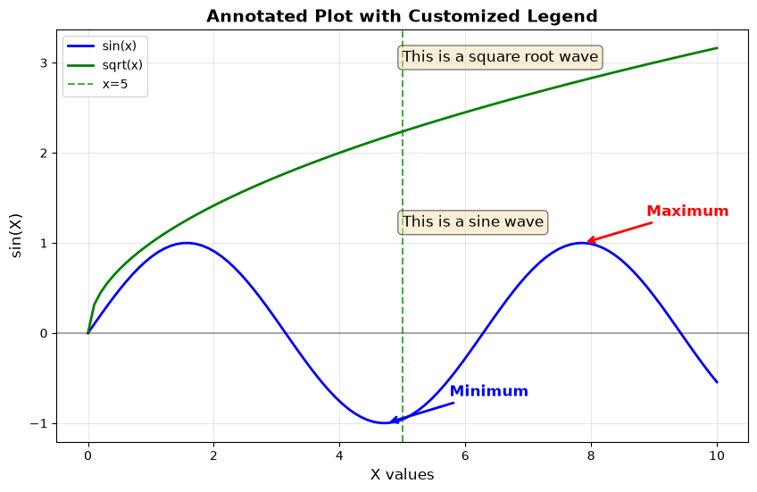

## <a name="save"></a> Section 10: Saving Figures
You can export your plots for reports, presentations, and just generally sharing your work!

We'll show you how to do this using the 2D histogram from above.

**Common Exporting Formats:**
- PNG
- PDF
- SVG
- EPS

**Common save parameters:**
- `dpi`: Resolution (dots per inch). Higher = better quality but larger file
- `bbox_inches='tight'`: Removes extra whitespace
- `format`: Explicit format specification
- `facecolor`: Background color

```python
# Using the 2D histogram example from above
# Histogram parameters & distribution data
N_points = 100000
dist1 = np.random.normal(size=N_points)
dist2 = np.random.normal(loc=10.0,size=N_points)

# Initialize figure
fig, ax = plt.subplots(nrows=1,ncols=1,figsize=(5,5))

# Make 2D histogram
hist = ax.hist2d(dist1, dist2, bins=(20,80), cmap='magma')

# Colorbar
cbaxes = fig.add_axes([.91, .11, .1, 0.77]) # Format: left edge position, bottom edge position, width, height
cbar=plt.colorbar(hist[3], orientation='vertical',cax=cbaxes)
cbaxes.yaxis.set_ticks_position('right') # must come AFTER plt.colorbar call
cbar.set_label('Counts',rotation=90,size=10, loc='center') # x=, y= can also be called here to set location of label (y for vertical cbars, x for horizontal cbars)

ax.set_title('Plot 1.3.1: 2D Histogram')

# Save the figure
# Common formats: PNG (raster), PDF (vector), SVG (vector), EPS (vector)
fig.savefig('magma_2d_histogram.png', dpi=300, bbox_inches='tight')
fig.savefig('magma_2d_histogram.pdf', bbox_inches='tight')  # Vector format (scalable)
print("Figure saved as 'magma_2d_histogram.png' and 'magma_2d_histogram.pdf'")

plt.show()
```

```
Figure saved as 'magma_2d_histogram.png' and 'magma_2d_histogram.pdf'
```

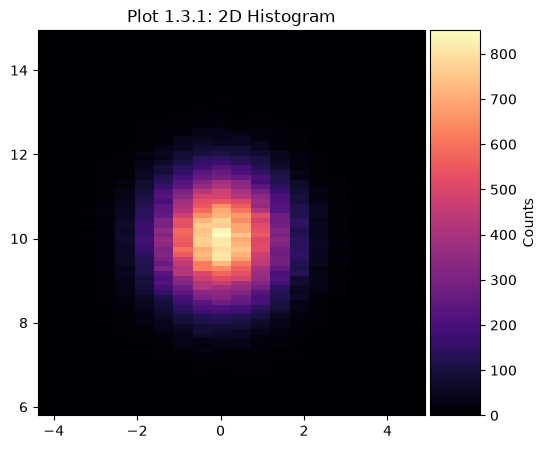

## <a name="cheat-sheet"></a> Common Matplotlib Functions Cheat Sheet
Quick reference for frequently used Matplotlib functions and parameters.


### Plot Types
- `plt.plot()` - Line plot
- `plt.scatter()` - Scatter plot
- `plt.bar()` / `plt.barh()` - Bar chart (vertical/horizontal)
- `plt.hist()` - Histogram
- `plt.boxplot()` - Box plot
- `plt.pie()` - Pie chart
- `plt.imshow()` - Display image/2D array

### Figure and Axes Creation
- `plt.figure(figsize=(width, height))` - Create figure
- `plt.subplots(nrows, ncols)` - Create subplots
- `fig, ax = plt.subplots()` - Object-oriented approach
- `plt.subplot2grid()` - Uneven subplot layouts

### Customization
- `plt.xlabel()` / `ax.set_xlabel()` - X-axis label
- `plt.ylabel()` / `ax.set_ylabel()` - Y-axis label
- `plt.title()` / `ax.set_title()` - Plot title
- `plt.legend()` / `ax.legend()` - Show legend
- `plt.grid()` / `ax.grid()` - Add grid
- `plt.xlim()` / `ax.set_xlim()` - Set x-axis limits
- `plt.ylim()` / `ax.set_ylim()` - Set y-axis limits
- `plt.xticks()` / `ax.set_xticks()` - Customize x-axis ticks
- `plt.yticks()` / `ax.set_yticks()` - Customize y-axis ticks

### Colors and Styles
- Colors: `'b'`, `'r'`, `'g'`, `'c'`, `'m'`, `'y'`, `'k'`, `'w'`
- Color names: `'steelblue'`, `'coral'`, `'darkgreen'`, etc.
- Hex codes: `'#FF6B6B'`
- Line styles: `'-'` (solid), `'--'` (dashed), `'-.'` (dash-dot), `':'` (dotted)
- Markers: `'o'`, `'s'`, `'^'`, `'*'`, `'+'`, `'x'`, `'D'`

### Annotations and Text
- `plt.annotate()` / `ax.annotate()` - Add annotation with arrow
- `plt.text()` / `ax.text()` - Add text
- `plt.axvline()` / `ax.axvline()` - Vertical line
- `plt.axhline()` / `ax.axhline()` - Horizontal line

### Saving and Displaying
- `plt.savefig(filename, dpi=300, bbox_inches='tight')` - Save figure
- `plt.show()` - Display plot
- `plt.tight_layout()` - Adjust spacing between subplots
- `plt.close()` - Close figure to free memory

### Working with Pandas
- `df.plot()` - Plot directly from DataFrame
- `df.plot(kind='line')` - Specify plot type
- `df.plot(x='col1', y='col2')` - Specify columns

### Styles
- `plt.style.use('style_name')` - Apply style
- Common styles: `'default'`, `'seaborn'`, `'ggplot'`, `'dark_background'`
- `plt.style.available` - List all available styles

