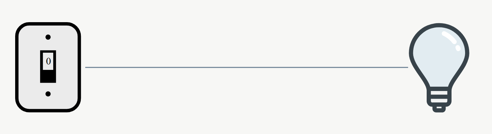
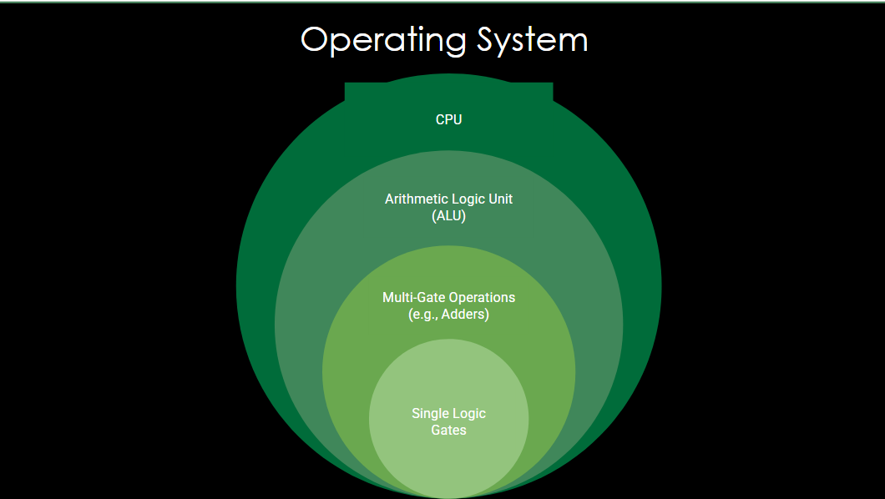
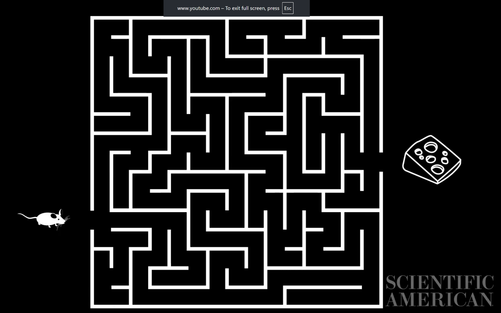
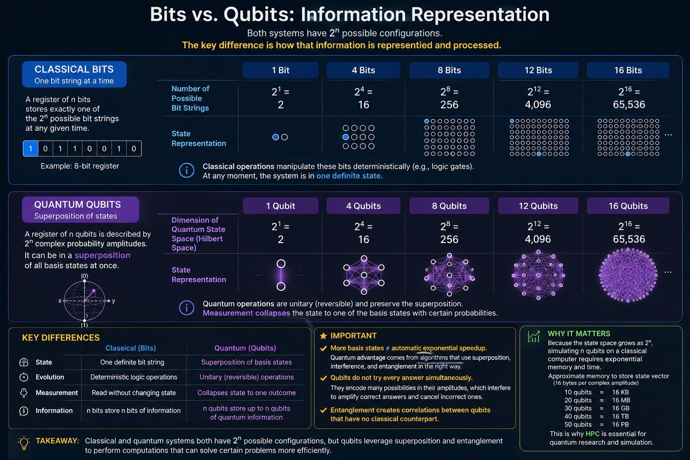
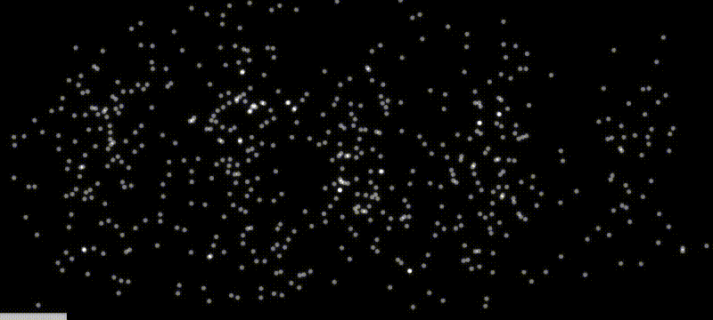
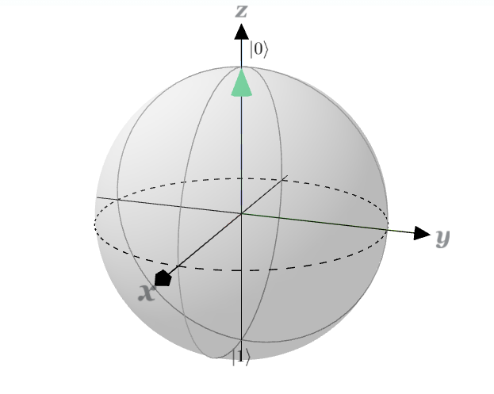
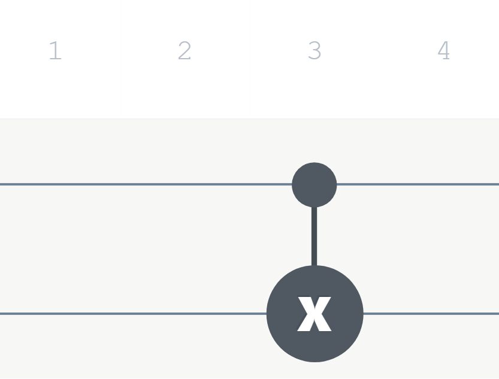
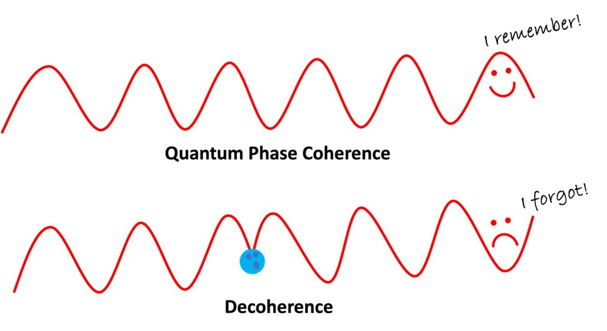
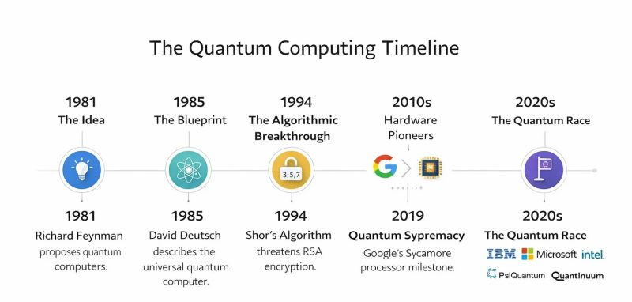

# Intro to Quantum Computing: Qubits, Quantum Circuits, & Physical Hardware

_README and slides created by Chance Loveday_

This README turns two 45–minute micro-lessons into a self-contained reading guide. It doesn't assume you've already seen gates, circuits, or real quantum hardware yet.

- **[Part 1 — Qubits, Entanglement & Quantum Circuits](#part-1--qubits-entanglement--quantum-circuits)**: the theory. What a qubit is, how quantum gates manipulate it, and how two-qubit gates create entanglement.
- **[Part 2 — Qubits in Physical 3D Space](#part-2--qubits-in-physical-3d-space)**: the engineering. How the abstract qubit from Part 1 actually gets built, cooled, controlled, and why it's so hard to keep working.

Between the two, in the original session, there's a built-in 10-minute break — treat the boundary here the same way if you're working through this in one sitting.

---

## Part 1 — Qubits, Entanglement & Quantum Circuits

### 1. A quick recap: classical bits and gates

Everything a classical computer does eventually comes down to **bits** — small binary objects that can hold exactly one of two states, 0 or 1. Your phone being "on" or "off" is the intuitive version; underneath, it's tiny transistors switching electrical signals on and off, the same way a switch turns a lightbulb on or off.

<p align="center"></p>

Bits by themselves don't do much. What makes them useful is **gates** — small operations that combine bits to produce new bits. Stack enough gates together and you get everything from an operating system, to a CPU, to the arithmetic logic unit (ALU) that does math, all the way down to single logic gates flipping transistors. Think of gates as the building blocks that only build to bigger and bigger things:

<p align="center"></p>

The classical gates worth knowing by name:

| Gate | Rule | Plain-English version |
|---|---|---|
| **AND** | True only if *both* inputs are true | Both switches need to be flipped on |
| **OR**  | True if *at least one* input is true | Either switch on is enough |
| **XOR** | True if *exactly one* input is true | One on, one off; not both |
| **NOT** | Flips the input | Whatever comes in, do the opposite |
| **NAND**| True only if *both* inputs are false | The "opposite of AND" — and interesting because, given only the output, you often can't work backward to figure out what the inputs were |

That last property of NAND — that you can't always reconstruct the inputs from the output — is worth sitting with, because it's exactly the kind of ambiguity quantum circuits are built to exploit, just in a very different way. If you want to build and test these gates yourself, [CircuitVerse's simulator](https://circuitverse.org/simulator) is a good sandbox.

### 2. Why classical computing hits a wall

Classical computers are great at problems where you can check possibilities one at a time. They start to struggle on problems where the number of possible solutions grows **exponentially** — where "just try everything" stops being realistic.

A useful mental picture: imagine the computer is a mouse, and the problem is a maze.

<p align="center"></p>

- **Classical computing** → Tries to escape the maze one path at a time, updating its map as it goes.
- **Quantum computing** → Considers all possible paths at once and explores the most probable ones first.

That difference is checking one path vs. holding many at once → this is the whole reason qubits are interesting.

### 3. Qubits and superposition

A **qubit** fills the same conceptual role as a bit, but it isn't limited to two fixed states. A qubit can exist in a *linear combination* of the two basis states, written **|0⟩** and **|1⟩** (read "ket-zero" and "ket-one;" these are state vectors, specifically *ket vectors*). Existing in a combination of both states at once is called **superposition**.

<p align="center"> and |1> states" width="420"></p>

_The catch:_ a qubit's state is fundamentally **probabilistic**, not certain. The moment you measure a qubit, its superposition **collapses** to the single state you actually saw. You don't get to peek at the "in-between;" you only ever get 0 or 1 out, with some probability of each depending on how the qubit was set up.

**The double-slit experiment:** This concept traces back to a real, physical experiment first performed in 1801. Shine light through a barrier with two slits, and it behaves like a wave: you get an interference pattern. Remember that light can also act like a particle. Now dim the light until only a single photon passes through the barrier at a time. You'd expect the interference pattern to disappear since there's nothing else for a lone photon to "interfere" with, but it doesn't. The interference pattern remains.

<p align="center"></p>

That result is strong evidence for superposition. The single photon is, in some sense, taking every available path at once, and those possibilities interfere with each other even though only one photon is present.

### 4. The Bloch sphere

Because a qubit can sit *between* |0⟩ and |1⟩, a simple lightswitch isn't enough to describe it. We need a 3-Dimensional picture. That picture is the **Bloch Sphere**.

<p align="center"></p>

A few things worth internalizing about it:

- |0⟩ sits at the north pole, |1⟩ at the south pole.
- **Every point on the sphere's surface is a valid superposition** — not just the poles.
- **Orientation matters.** A qubit "halfway between |0⟩ and |1⟩" isn't a single state; where it sits on the sphere (not just how far from the poles) changes what state it actually is.

You can play with this interactively at IQM's [Bloch sphere simulator](https://www.iqmacademy.com/play/bloch/).

### 5. Quantum gates

Quantum gates do for qubits what AND/OR/NOT do for bits, except with two properties classical gates don't generally have:

1. **They're reversible.** You can always run a quantum gate "backward" to recover the input. (Classical computers *can* be built to run reversibly, but it's rarely worth the cost.)
2. **They enable parallel computation** by manipulating superpositions directly.

Every single-qubit gate below is really just a specific rotation of the point on the Bloch sphere.

**The Hadamard (H) gates**

| Gate | What it does | On the Bloch sphere | Example |
|---|---|---|---|
| **H** | Creates an equal superposition of \|0⟩ and \|1⟩ | 90° across the y-axis, then 180° across the x-axis | \|0⟩ → H → \|+⟩ |

The Hadamard gate has a neat special property: apply it twice in a row and you're back where you started. More generally, **an even number of H-gates resets the qubit to its initial value**; the rotations cancel out.

**The Pauli gates (X, Y, and Z)**

Pauli gates all rotate the qubit 180° around some axis:

| Gate | What it does | On the Bloch sphere | Example |
|---|---|---|---|
| **Z** | Keeps the same measured state, but flips the *phase* | 180° across the z-axis | \|0⟩ → Z → \|0⟩ |
| **Y** | Flips the current state, like X | 180° across the y-axis | \|0⟩ → Y → \|1⟩ |
| **X** | Flips the current state | 180° rotation across the x-axis | \|0⟩ → X → \|1⟩ |

**The phase gates (S and T)**

These are *smaller* rotations around the z-axis than a full Pauli-Z flip:

| Gate | Fraction of a Z-gate | On the Bloch sphere |
|---|---|---|
| **S** | 1/2 × Z | 90° across the z-axis |
| **T** | 1/4 × Z | 45° across the z-axis |

### 6. Multi-qubit circuits: CNOT and entanglement

Single-qubit gates rotate one qubit at a time — but the real power of quantum computing comes from letting qubits *interact*. Recall NAND from the classical section: given only its output, there are too many possible input combinations to work backward reliably. Quantum computing's answer to "how do we let one qubit's state control another's?" is the **CNOT (Controlled-NOT) gate**.

<p align="center">
  
  
</p>

A CNOT gate takes a **control qubit** and a **target qubit**: if the control qubit is |1⟩, the target qubit is flipped (an X gate is applied); if the control is |0⟩, the target is left alone. What makes this powerful is that the control qubit can be in superposition, meaning the "flip" and "no flip" outcomes both happen at once, linking the two qubits together.

This linking is called **entanglement**. Once two qubits are entangled, measuring one of them immediately tells you something about the other, regardless of the correlation being probabilistic beforehand. Remember superposition collapsing on measurement? The same thing applies here: **observing one entangled qubit collapses its superposition, and that collapse propagates to its entangled partner(s) too.**

CNOT is one of the primary ways to *create* entanglement, but it's not the only two-qubit gate. It's simply the one you'll see most often.

### 7. Why any of this matters: universality

Not every gate is created equal in terms of what you can build from it. A **universal gate set** is a small collection of gates that can be combined to reproduce *every other gate* in the system.

- **Classical example:** {OR, AND, NOT} is a universal set → combine these three and you can build any classical logic circuit.
- **Quantum example:** {H, S, T, CNOT} is a common universal set for quantum circuits.

Because quantum gates are reversible, a universal quantum gate set preserves more information through a computation than its classical counterpart does.

### 8. Why qubits matter

A few grounding truths worth keeping in mind as you go further:

- Qubits give you dramatically more room to represent information than bits do, because you're working with continuous points on a sphere rather than a fixed state (0 or 1).
- **Quantum computing isn't replacing classical computing** → not soon, and arguably not ever entirely.
- Qubits and quantum computers aren't a fix-all. They make *certain* problems dramatically easier — but not everything.

### 9. Applications

Where does the qubit + gate + entanglement machinery actually get used?

- **Optimization** through quantum algorithms
- **Modeling complex chemical structures** → speeding up drug synthesis by more accurately simulating chemical interactions
- **Developing and modeling new superconducting materials**
- **Analyzing cryptographic systems** and motivating post-quantum security

---

## Part 2 — Qubits in Physical 3D Space

Part 1 treated gates as abstract boxes sitting on a Bloch sphere. Part 2 opens the box: how does a qubit — a mathematical idea — become a physical object you can build, cool, and control?

```
Qubits → Quantum Circuits → Quantum Algorithms → Compiler → Hardware
```

### 1. Three ways to physically build a qubit

There's no single, settled architecture for quantum hardware. Three models currently lead the field (others exist, but these are where the frontrunners are concentrated):

| Model | What the qubit actually is | Gates controlled by | Operating temperature | Example companies |
|---|---|---|---|---|
| **Superconducting circuits** | A tiny superconducting electrical circuit | Microwave pulses | 10–15 mK | IBM, IQM, Google |
| **Trapped ions** | Encoded in the stable energy levels of ions | Precise lasers | Room temperature, inside a vacuum-sealed chamber | IonQ, Quantinuum |
| **Neutral atoms** | Encoded in the energy levels of electrons in uncharged atoms held by "optical tweezers" | Precise lasers | Ultracold (below 1 mK) | QuEra (Caltech-affiliated) |

Each model trades off differently between stability, control precision, and how hard it is to scale to more qubits.

### 2. Anatomy of a quantum computer

For the superconducting-circuit model (the one behind IBM, IQM, and Google's machines), the general shape of the hardware looks like a chandelier: a core surrounded by circuitry, with gold plates separating each layer that narrow the deeper into the system you go.

<p align="center"></p>

**ORNL's Pathfinder.** A concrete, current example of this architecture is [Pathfinder](https://www.ornl.gov/news/ornl-deploys-new-iqm-quantum-computer), the IQM-built quantum computer recently deployed at Oak Ridge National Laboratory. Even though Pathfinder is brand new, it follows the same general superconducting-circuit pattern:

- A **Bluefors dilution refrigerator** — a cryosystem capable of holding temperatures at or below 10 mK
- A **Quantum Processing Unit (QPU)** with 20 qubits
- **Couplers** connecting qubits to each other
- **Control and flux lines** carrying instructions in and signals out
- A connection to HPC (high-performance computing) systems via a dedicated test bed

### 3. How gates physically exist

In a classical computer, a logic gate is a physical circuit controlled by transistors; the gate *is* the hardware. Quantum computers separate the two: the qubit can be represented physically (as in the three models above), but the **gate** is applied to it as a pulse or signal from the outside, rather than being a fixed piece of circuitry.

- **Superconducting circuits** → gates applied via **microwave pulses**
- **Trapped ions & neutral atoms** → gates applied via **lasers**
- Other designs → various forms of **electrical pulses**

The path from code to physical signal looks roughly like: a script is written (e.g., in a framework like Qiskit), **transpiled** into hardware-specific instructions, and finally mapped onto a sequence of microwave pulses (or laser pulses, depending on the hardware).

### 4. Cooling systems

Superconducting qubits only behave like qubits at extraordinarily low temperatures. The Bluefors cryosystem that keeps Pathfinder's qubits functional is a gas-driven cooling system that gets there in stages:

1. Room temperature starts around **~300 K**.
2. **Helium compressors** chill the entire system down to **4 K**.
3. A second, separate gas-handling cooling loop then pushes the *internal* temperature down further, to **≤ 10 mK**.

For context: **10 mK is roughly 270 times colder than deep space.** That extreme cold is necessary to keep qubits in their fragile quantum states. Without it, the system rapidly loses quantum information.

### 5. Noise: decoherence and its sources

**Decoherence** is what happens when a qubit's superposition breaks down and the system loses quantum information. It can show up as a bit flip, a phase flip, or some other form of corrupted information — and it's one of the single biggest roadblocks to scaling up the number of qubits in a working system.

<p align="center"></p>

Quantum states are delicate, and almost any disturbance can interrupt a qubit's superposition, along with anything it's entangled with, potentially breaking the whole system. Common sources of that disturbance:

- Heat
- Vibrations
- Electromagnetic interference
- Material defects
- Background radiation
- Cosmic rays

**Approaches to error correction** (techniques to protect against noise and catch errors when they happen):

| Approach | Pros | Cons |
|---|---|---|
| Many physical qubits per 1 reliable *logical* qubit | One extremely reliable computer, in theory | Can take hundreds of physical qubits just to support error correction for one logical qubit |
| Noisy Intermediate-Scale Quantum (NISQ) computers | Enables newer, more error-tolerant algorithms right now | Not generalizable or easily scalable |
| Find a new physical qubit representation entirely | Could be inherently more stable | Some candidate particles are still purely theoretical, or years away |

### 6. Classical vs. quantum computers, side by side

| Category | Classical Computers | Quantum Computers |
|---|---|---|
| Basic unit | Deterministic bits (0 or 1) | Probabilistic qubits (\|0⟩ and \|1⟩) |
| Core hardware | Silicon transistors and CPUs | Qubits via superconducting circuits, trapped ions, or neutral atoms |
| Error rates | Very low, highly stable | Currently high, due to noise and decoherence |
| Operating temperature | Near room temperature | Typically near absolute zero (0 K) |
| Cost | Affordable for consumers and enterprises | Extremely expensive, specialized infrastructure |
| Best use cases | Web applications, gaming, databases, AI training | Molecular simulation, optimization, cryptography, quantum machine learning, materials science |
| Current state | Fully mature, mainstream technology | Early-stage, NISQ-era technology |

### 7. Where this is headed

<p align="center"></p>

Roadmaps from major players (IBM's among them) point toward steadily increasing qubit counts, better error correction, and improving reliability over the coming years. However, **we've barely scratched the surface yet.**

---

## Further resources

From the original lesson's resource list:

- [Quantum Computing vs. Classical Computing](https://www.bluequbit.io/blog/quantum-computing-vs-classical-computing) — BlueQubit
- [ORNL Deploys IQM Pathfinder](https://www.ornl.gov/news/ornl-deploys-new-iqm-quantum-computer) — ORNL news
- [Noise in Quantum Computing](https://aws.amazon.com/blogs/quantum-computing/noise-in-quantum-computing/) — AWS
- [Quantum Gates + Circuits](https://youtu.be/HHV-P4_Xp1E) — video
- [How Does a Quantum Computer Work?](https://youtu.be/uLnGp1WTNFQ) — video
- [Caltech's Quantum Computer](https://youtu.be/OeoXOhpO1tw) — video

Interactive tools referenced throughout the lessons:

- [CircuitVerse simulator](https://circuitverse.org/simulator) — build and test classical logic circuits
- [IQM Bloch sphere simulator](https://www.iqmacademy.com/play/bloch/) — play with qubit states in 3D
- [IQM Resonance](https://iqm.tech/products/iqm-resonance/) — IQM's cloud platform for hands-on scripting with Qiskit or Qrisp once you're ready to move from theory to code

---

*Source material: "Intro to Qubits and Quantum Circuits" and "Qubits in Physical 3D Space," NGP quantum micro-lessons, OLCF/ORNL, July 2026.*
